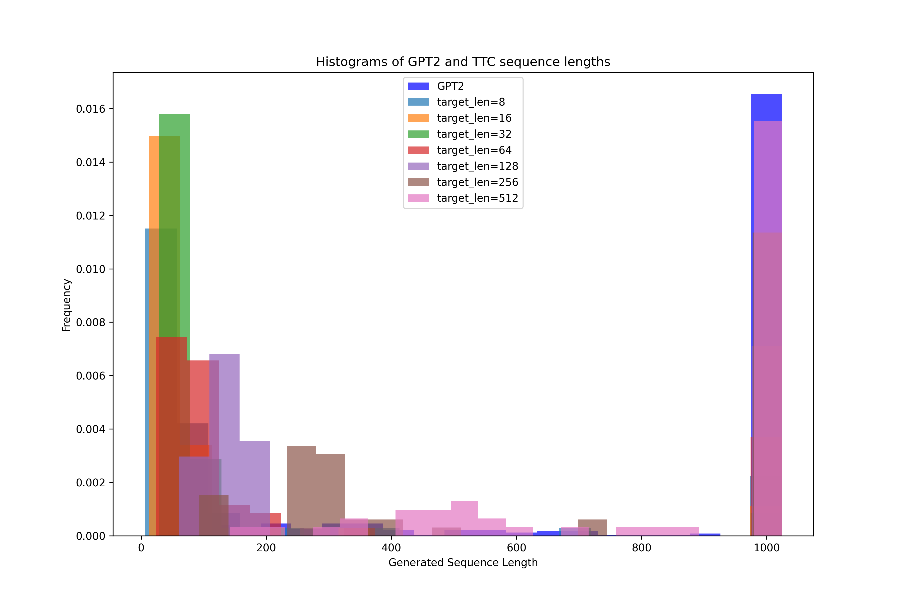
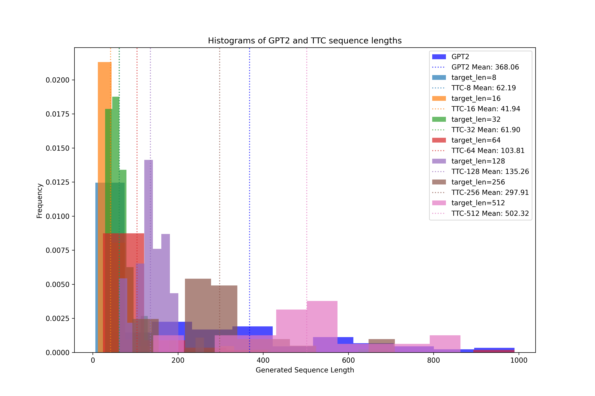

# Controlling LLM Output Length

In this experiment, we introduce special token tags that are decremented as the model is sampled, telling it how many tokens remain before the EOS token should be sampled. The goal is to see whether the length of content generated by an LLM can be controlled by a user.

## Training
Tokens to completion (TTC) tokens are introduced at training time since the location of EOS tokens is known. At inference time a desired target length is specified, and the TTC tokens are generated internally. We modify the GPT-2 architecture so that TTC tokens contribute keys, but not queries, to the calculation of self-attention. This allows them to contribute information to the model without "existing" in the sequence.
We fine-tune GPT-2 on the wikipedia dataset with EOS tokens placed at the end of each article.

## Results
We prepare an open-ended prompt and compare the pre-trained GPT-2 generations to our modified GPT-2 generations. We request request generations of different target lengths using the TTC mechanism and compare the distribution of response lengths to the base GPT-2 response lengths.

A large number of responses never sampled an EOS token and reached the maximum generation length of 1024. On inspection, these responses were primarily cases in which the model got caught in a generation loop.
To better inspect the response length distributions, we exclude all responsese of length 1024 from the histograms.

The results show that the average response lengths for TTC generations differ from the avarage response length of the base GPT-2 model. 
The average response lengths of the TTC sequences did not exactly match the requested generation lengths, however there were clear shifts in the response length distributions as different target lengths were requested.
The longer requested responses appeared to more accurately center around their target values.
The average response lengths were correctly ordered with the notable exception of target length 8, which had a greater average response length than target lengths 16 and 32.
